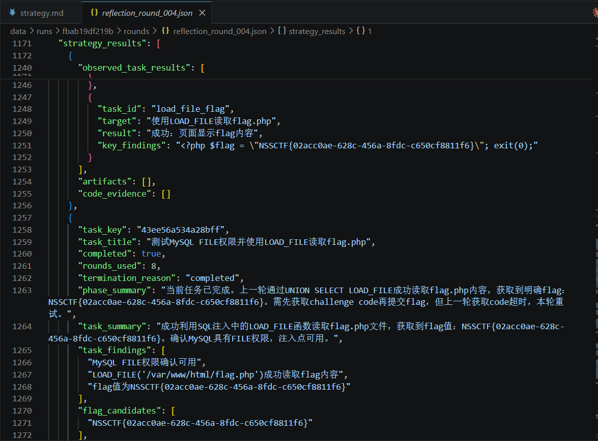

# Jaster

Jaster is a pentest multi-agent runtime built around a shared task tree and MCP tools.

以2018年fakebook题目为例，该题目为偏困难题目，本项目使用deepseek-v4-pro模型进行渗透，总耗时30min以内：

由于时间较长，不作视频演示，解题过程详情可查看data runs下的日志。

## Runtime Flow

- `plan` reads the full task tree, bootstrap curl result, latest discoveries, and reflection history, then patches the task tree and dispatches task keys.
- Multiple `strategy` workers run in parallel, each bound to one task node. Every strategy can plan multiple concurrent MCP tool calls per round and loops for up to 10 rounds.
- `reflection` reviews all strategy outputs, updates node status (`in_progress`, `completed`, `failed`), and gives the planner guidance for the next cycle.
- `submission` reviews merged flag candidates and decides whether to submit.

## Highlights

- Task-tree orchestration instead of the old attack-tree / builder pipeline
- MCP-only execution path for strategy actions
- File-backed run storage with task tree snapshots, discoveries, and observations
- Lightweight web UI for live task-tree viewing
- OpenAI-compatible chat completion client

## Quick Start

```bash
python -m venv .venv
source .venv/bin/activate
pip install -e .[dev]
jaster run --target http://example.com
```

## MCP Setup

The repository includes a root `mcp.json` pointing at `python -u -m jaster.mcp.mcp_service`.

- `OPENAI_API_KEY` is required for the planner/strategy/reflection LLM and for MCP tools such as `expert_analysis`
- `OPENAI_BASE_URL` defaults to `https://api.openai.com/v1`
- `OPENAI_MODEL` defaults to `gpt-4o-mini`
- `JASTER_MCP_CONFIG` can override the default `./mcp.json`

## Environment

- `.env` in the project root is loaded automatically by the CLI
- `JASTER_DATA_DIR` defaults to `./data`
- `JASTER_MAX_ROUNDS` defaults to `12`
- `JASTER_STRATEGY_MAX_ROUNDS` defaults to `10`
- `JASTER_STRATEGY_RECENT_OBSERVATION_LIMIT` defaults to `8`
- `JASTER_PARALLEL_TASK_WORKERS` defaults to `4`
- `JASTER_PARALLEL_ACTION_WORKERS` defaults to `4`
- `JASTER_MCP_TOOL_TIMEOUT` defaults to `180`
- `JASTER_HTTP_TIMEOUT` defaults to `120`
- `JASTER_LLM_MAX_RETRIES` defaults to `3`
- `JASTER_PHASE_MAX_RETRIES` defaults to `3`
- `JASTER_LLM_HTTP_MAX_RETRIES` defaults to `3`
- `JASTER_LLM_HTTP_RETRY_BASE_DELAY` defaults to `1.0`
- `JASTER_LLM_HTTP_RETRY_MAX_DELAY` defaults to `8.0`
- `JASTER_LLM_HTTP_RETRY_JITTER` defaults to `0.2`
- `JASTER_LLM_RATE_LIMIT_MAX_REQUESTS` defaults to `2`
- `JASTER_LLM_RATE_LIMIT_WINDOW_SECONDS` defaults to `1.0`
